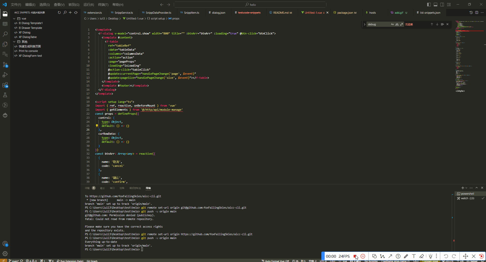
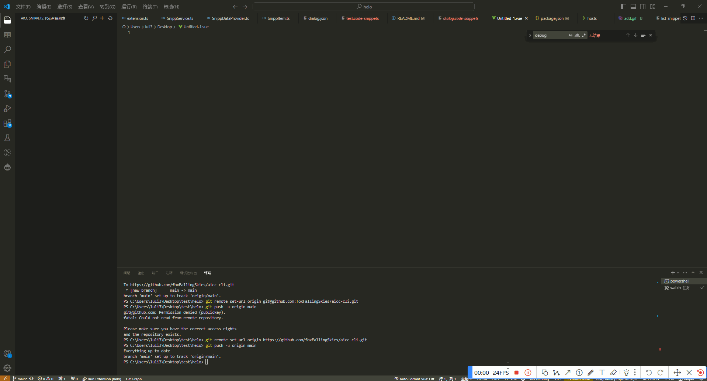
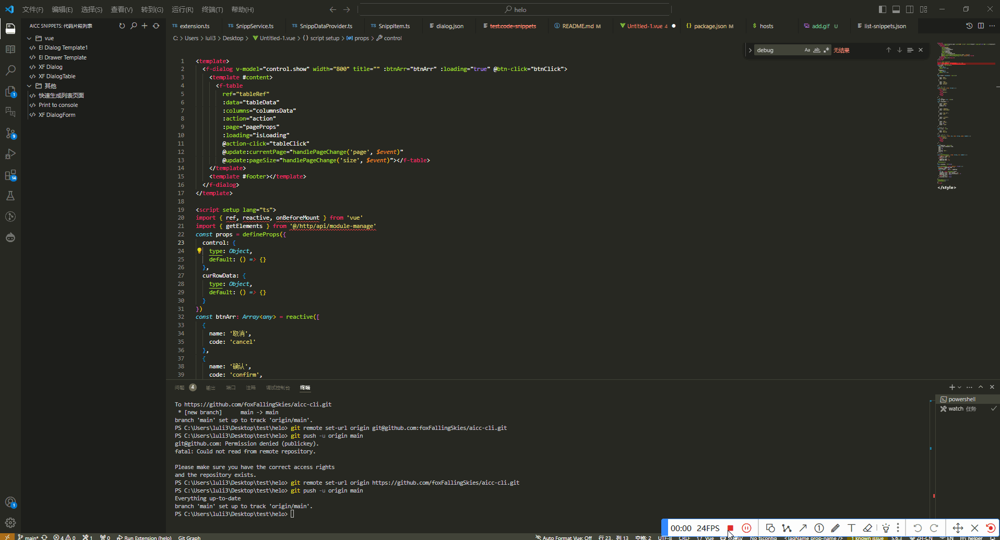
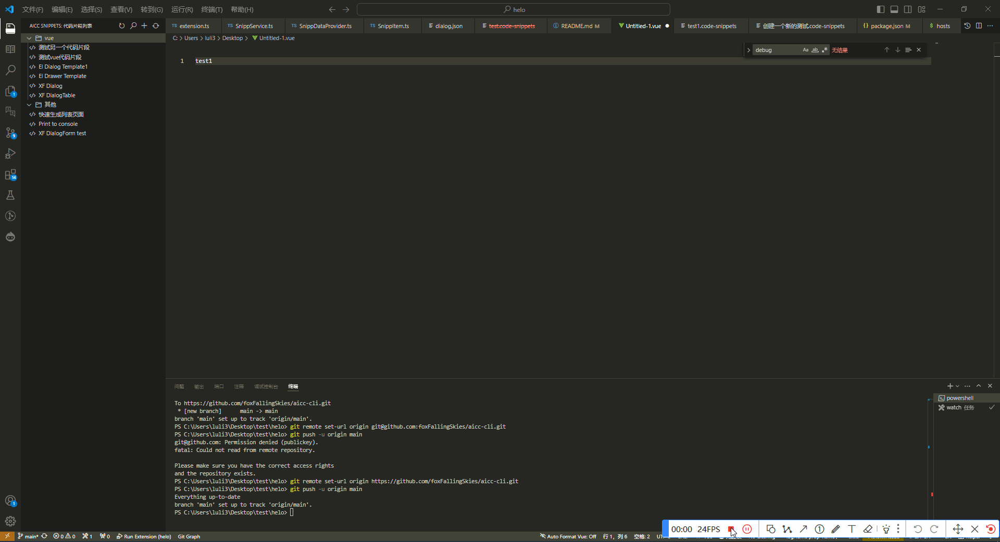
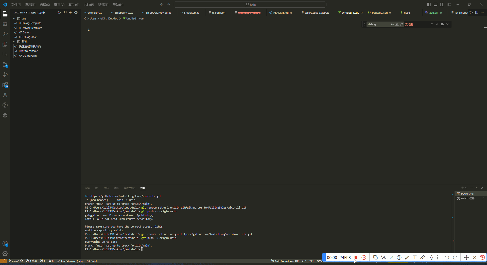

# AIcc ui 插件
Aicc 团队内部插件，能够实现代码片段的管理，以及内部组件库的快捷功能插件
### 配置代码片段存储的本机地址,配置`snippet.user.dir`

### 创建和插入代码片段
在代码片段视图中点击条目，则会将代码片段插入到当前激活文档的光标位置。以及可以替换选中的

### 同步内置代码片段
可以直接同步内置的代码片段

### 编辑代码片段

### 删除代码片段

### 搜索代码片段
可以通过搜索快速找到所需要的代码片段插入
